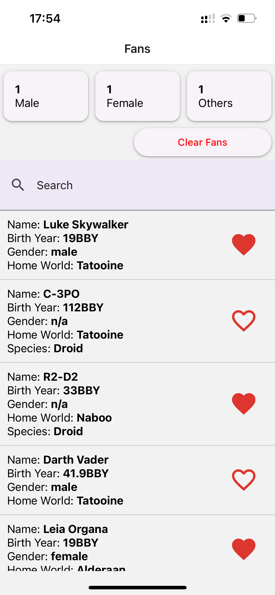
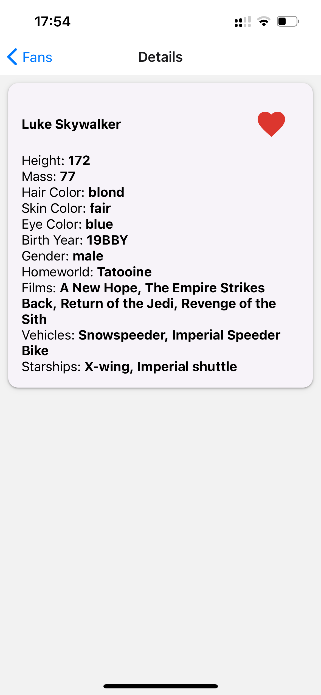

# Star Wars Favorites Mobile Application

This mobile application, built using React Native, allows users to explore and favorite characters from the Star Wars universe. It fetches data from the Star Wars API (SWAPI) and provides detailed character information. Users can mark characters as favorites and see a count of favorite characters by gender.

## Features

- Fetch and display a paginated list of Star Wars characters.
- Search characters by name.
- View detailed information about a character.
- Add characters to favorites.
- Display the count of favorite characters by gender.
- Reset all favorites.

## Tech Stack

- React Native
- TypeScript
- Axios
- React Navigation
- React Native Paper
- React Context

## Installation

1. **Clone the repository**:
    ```sh
    git clone https://github.com/javelinck/StarWarsFavorites.git
    cd StarWarsFavorites
    ```

2. **Install dependencies**:
    ```sh
    yarn install
   
    # after
    cd ios && pod install
    ```

3. **Start the Metro bundler**:
    ```sh
    yarn start
    ```

4. **Run the app on iOS**:
    ```sh
    yarn ios
    ```

5. **Run the app on Android**:
    ```sh
    yarn android
    ```

## Usage

### Adding Favorites

- Navigate to the main screen to see a list of Star Wars characters.
- Click on a character to view detailed information.
- Use the heart icon to add or remove characters from your favorites.

### Searching Characters

- Use the search bar on the main screen to filter characters by name.

### Resetting Favorites

- Click the "Clear Fans" button on the main screen to reset all favorites and counts.

## API

This application uses the [Star Wars API (SWAPI)](https://swapi.dev/) to fetch character data. The `fetchCharacters` function handles paginated requests and additional data fetching for homeworld and species information.

## Screenshots


 

